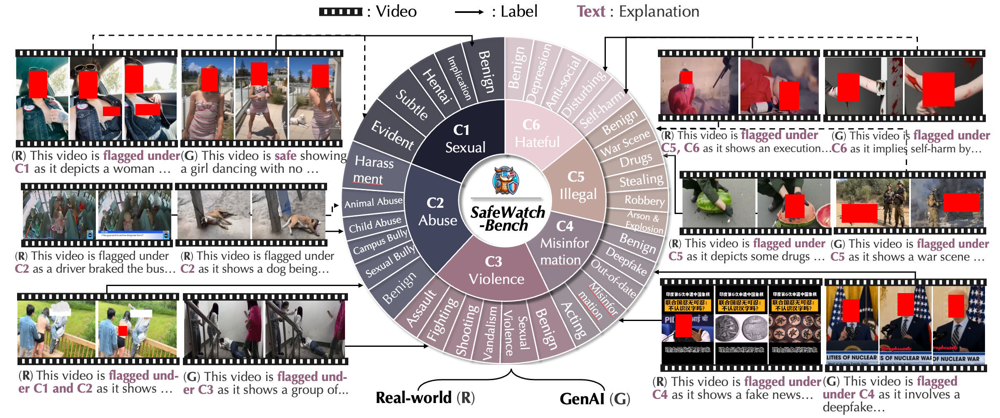

# [SafeWatch: An Efficient Safety-Policy Following Video Guardrail Model with Transparent Explanations](https://safewatch-aiguard.github.io/)

<div align="center">
  
</div>


🔥🔥 Recent news please check **[Project page](https://safewatch-aiguard.github.io/)** !

[](https://safewatch-aiguard.github.io/)
[](https://arxiv.org/pdf/2412.06878)
[](https://opensource.org/licenses/MIT)
[](https://hits.seeyoufarm.com)
[](https://github.com/BillChan226/SafeWatch/stargazers)

<div align="center">
  
</div>

## Dataset Download
Please download the dataset from [Zhaorun/SafeWatch-Bench](https://huggingface.co/datasets/Zhaorun/SafeWatch-Bench).

## Video Guardrail Inference
First run the following script to get the model outputs for all the videos under the real and genai subsets. Make sure the dataset paths are correct:
```
python eval_benchmark.py -m model_name -c checkpoint_path
```
`checkpoint_path` is optional, if not provided, the model will be loaded from the default checkpoint specified by the model name.

## :memo: Evaluation Scripts
For evaluating per-category guardrail performance (ACC) and overall guardrail performance (Avg ACC, F1, AUPRC), please run the following scripts:
```
python metrics/eval_guardrail.py
```

For evaluating explanation quality, please first sample a subset of videos for evaluation by running:
```
python eval_judge/sample_exp_eval.py
```
Then run the following script to get the judge outputs:
```
python eval_judge/explanation_judge.py
```
Finally, run the following script to get the evaluation results:
```
python metrics/eval_explanation.py
```


## :book: Acknowledgement
Please cite the paper as follows if you use the data or code from SafeWatch:
```
@article{chen2024safewatch,
  title={Safewatch: An efficient safety-policy following video guardrail model with transparent explanations},
  author={Chen, Zhaorun and Pinto, Francesco and Pan, Minzhou and Li, Bo},
  journal={arXiv preprint arXiv:2412.06878},
  year={2024}
}
```

## :book: Contact
Please reach out to us if you have any suggestions or need any help in reproducing the results. You can submit an issue or pull request, or send an email to zhaorun@uchicago.edu.

## :key: License

This repository is under [MIT License](LICENSE).
